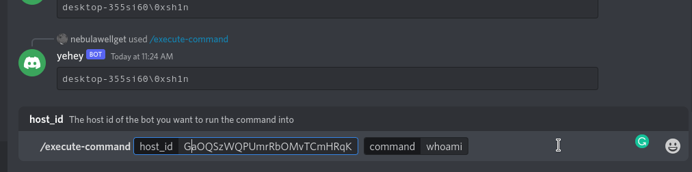

    <h1>s1lkmod</h1>
    <h4>Discord: Command and Control</h4>

`s1lkmod` is a command and control (C2) application that takes advantage of Discord for its communication channel. This allows users to easily set up a C2 platform for their red team or penetration testing engagements. 

**Target Model:** Low security

`s1lkmod` is composed of two components:
1. The Agent - the binary that will be deployed to the devices. (Only supports Windows)
2. The Builder - the binary that will build the agent with your configurations.

## ❗ Disclaimer
I am not responsible for any damages, actions, or misdeeds that you have incurred with this project.

This project has been shared for educational purposes only. To get feedback from people on my code.

Under no circumstances this application should be used for malicious purposes.

There would be also no support to be provided on how to compile the binaries or how to use the application. 

## 🔑 Key features
- Command execution
- Upload
- Download
- Persistence through startup

### 🙌 Special thanks
th3r4ven - for inspiring me with his project [Bifrost](https://github.com/th3r4ven/Bifrost).

bwmarrin - for creating a [go package](https://github.com/bwmarrin/discordgo) that provides bindings to Discord's API.